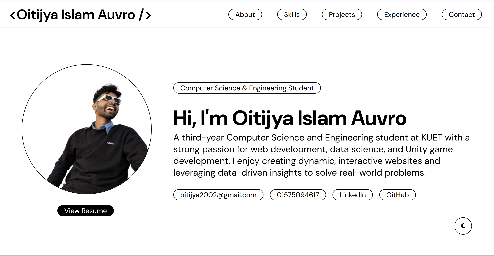

# Oitijya Islam Auvro - Portfolio

My personal portfolio website showcasing my projects, skills, and experience as a Computer Science and Engineering student at KUET.



## 🌐 Live Demo

Visit my portfolio: [https://porfolio-website-alpha-six.vercel.app](https://porfolio-website-alpha-six.vercel.app)

## 👨‍💻 About Me

I'm a third-year Computer Science and Engineering student at Khulna University of Engineering & Technology (KUET) with a strong passion for:
- **Web Development** - React, Next.js, HTML/CSS, JavaScript
- **Data Science** - Data visualization, analysis, and machine learning
- **Unity Game Development** - Creating interactive gaming experiences
- **Mobile App Development** - React Native applications

**Current CGPA:** 3.63

## 💼 Featured Projects

### 1. **Mio** 
React Native and Expo application that connects users based on their favorite TV shows and movies. Facilitates connections among entertainment enthusiasts.
- **Tech Stack:** React Native, Expo, TypeScript
- **Links:** [GitHub](https://github.com/AuvroIslam/Mio-typeScript-) | [Google Play](https://play.google.com/store/apps/details?id=com.mioapp.social&hl=en) | [Promo Video](https://www.facebook.com/watch/?v=1234744761338742)

### 2. **Waste Recognition Model**
Deep learning model for waste classification using Fast.ai and Hugging Face, deployed with a web interface.
- **Tech Stack:** Python, Fast.ai, Hugging Face, HTML, CSS, JavaScript
- **Links:** [GitHub](https://github.com/AuvroIslam/wasteRecognizer) | [Live Demo](https://auvroislam.github.io/wasteRecognizer/)

### 3. **GDP vs. Olympic Performance**
Data visualization project exploring the correlation between GDP and Olympic achievements using Tableau Dashboards and React.
- **Tech Stack:** React, Tableau, Data Visualization
- **Links:** [GitHub](https://github.com/AuvroIslam/Olympic_vs_Gdp) | [Live Demo](https://olympic-vs-gdp-website.vercel.app)

### 4. **3Knot3**
Top-down 3D action game inspired by the 7 Bir Sreshtho (heroes) from the 1971 Bangladesh Liberation War.
- **Tech Stack:** Unity, C#, Game Development
- **Links:** [GitHub](https://github.com/Learnathon-By-Geeky-Solutions/studio71) | [Play Online](https://studio-71.itch.io/echoes-of-71) | [Promo Video](https://www.facebook.com/share/v/1CdAbhr8m9/)

## 🛠️ Technologies Used

- **Frontend:** React, HTML, CSS, JavaScript, TypeScript
- **Frameworks:** Next.js, Tailwind CSS, DaisyUI, Shadcn UI
- **Mobile:** React Native (Expo)
- **Data Science:** Python, Pandas, Matplotlib, Fast.ai
- **Game Development:** Unity, C#
- **Databases:** MongoDB, MySQL, PostgreSQL
- **Tools:** Git, VS Code, Android Studio, Tableau Public
- **Deployment:** Vercel, GitHub Pages

## 💼 Experience

**Unity Game Developer Intern** - Geeky Solutions  
*January 2025 - May 2025 | Remote*  
- Built a full Unity game with gameplay features, UI elements, animations, and level improvements

**Teaching Assistant, React Native** - Ostad  
*August 2025 - November 2025 | Remote*  
- Supported learners on an Edtech platform teaching core React Native concepts
- Reviewed code and guided students through mobile development tasks

## 🚀 Getting Started

### Prerequisites
- Node.js (v14 or higher)
- npm or yarn

### Installation

1. **Clone the repository**
   ```bash
   git clone https://github.com/AuvroIslam/Porfolio_Website.git
   cd Porfolio_Website
   ```

2. **Install dependencies**
   ```bash
   npm install
   ```

3. **Run development server**
   ```bash
   npm start
   ```

4. **Open in browser**
   ```
   http://localhost:3000
   ```

## 📦 Build for Production

```bash
npm run build
```

This creates an optimized production build in the `build` folder.

## 🚀 Deployment to Vercel

### Automatic Deployment (Recommended)

1. **Push to GitHub**
   ```bash
   git add .
   git commit -m "Update portfolio"
   git push
   ```

2. **Connect to Vercel**
   - Go to [vercel.com](https://vercel.com)
   - Sign in with GitHub
   - Click "Add New Project"
   - Import your repository
   - Click "Deploy"

3. **Auto-Deploy is Active!**
   - Every push to GitHub automatically deploys to Vercel
   - Changes go live in ~1 minute

### Vercel Settings
- **Framework Preset:** Create React App
- **Root Directory:** `./`
- **Build Command:** `npm run build`
- **Output Directory:** `build`

## 📧 Contact Form

The contact form uses [Formspree](https://formspree.io/) to handle submissions. Messages are sent to: **oitijya2002@gmail.com**

## 📝 Customization

To customize the portfolio with your own information:

1. Update personal details in `src/App.js`
2. Replace project images in `src/Components/Projects/`
3. Update profile picture in `src/Components/Projects/profile_pic.png`
4. Modify the CV file in `public/Oitijya_Islam_Auvro_CV.pdf`

## 🔗 Connect With Me

- **LinkedIn:** [Oitijya Islam Auvro](https://www.linkedin.com/in/oitijya-islam-auvro-a252a5325/)
- **GitHub:** [@AuvroIslam](https://github.com/AuvroIslam)
- **Email:** oitijya2002@gmail.com
- **Phone:** 01575094617

## 📄 License

This project is open source and available under the [MIT License](LICENSE).

---

**Built  by Oitijya Islam Auvro**  
*Computer Science & Engineering Student | KUET*
